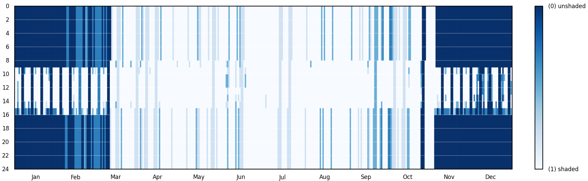
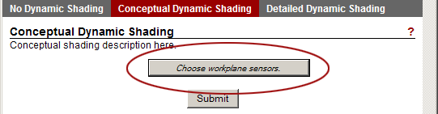
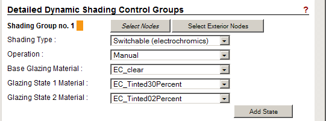

Advanced Shading - Climate Based Metrics (CBM)
================================================

In a real building, shading devices are not all opened and closed at the same time but can be operated independently. DIVA therefore implements shading controls for up to two independent shading groups that can be controlled independently of each other. The shading groups can for example correspond to venetian blinds for different facade orientations or a facade may have two sets of blinds, one in the upper and one in the lower part.

These shading controls can be implemented in any Climate-Based Metrics (DAYSIM) simulation and will affect the amount of available daylight, view to the outside, and any lighting control systems in the space.

*Example of an hourly shading schedule output from a DIVA climate-based simulation*

The shading control options dialog is located in, **Materials >> Shading Controls**

No Dynamic Shading 
------------------
When this option is selected, no shading systems are considered beyond what is modeled in Rhino as exported geometry. In effect, windows are modeled as 'open' at all times and no blinds or operable shading devices influence the available daylight, even if occupant discomfort might be a problem.

Conceptual Dynamic Shading 
-----------------------------------
Conceptual dynamic shading considers the operation of an idealized blind that covers all windows in the scene **without** the need for modeling the device geometrically. The effect of this blind is to reflect all direct sunlight and allow only 25% of diffuse sunlight into the space. Using conceptual shading is very fast and takes the same amount of time as running an identical simulation with no dynamic shading.Conceptual shading devices are limited in their control, and it can be considered that all are down or all are up at the same time. 

*Choosing workplane sensors is necessary for results with dynamic shading to be meaningful.*

The control of dynamic shading devices uses the Lightswitch algorithm (Reinhart, 2004). If an annual glare calculation has been run, then the predicted occupant discomfort is used to determine whether an occupant will lower a shade or not (lowered when DGP>0.4). Otherwise, occupants decide whether or not to lower the conceptual shading system by the presence of direct sunlight at each time step in the annual simulation. For this, it is necessary to define where occupants sit by choosing workplane sensors. If workplane senors are **not chosen,** then the presence of direct light on any sensor (even those near the window) will cause shading to be lowered. 

Detailed Dynamic Shading 
-----------------------------------
Detailed dynamic shading controls have two shading-type modes: Mechanical and Switchable (electrochromic). The **mechanical** mode is used to control dynamic geometric shading such as blinds or rotating louvers which are modeled on separate layers in Rhino. The **switchable** mode is used to control glazing which changes state from mostly transparent to mostly opaque by switching out material definitions for a specific glazing material. 

Mechanical Dynamic Shading
-----------------------------
Mechanical shading systems take Rhinoceros layers as their input. For example, to model a dynamic venetian blind, it is necessary to actually create the geometry of the blind on a discrete layer and to assign a material to it. Then under the field **Base Geometry Layer,** "No fixed shading state (blank.rad)" will be selected since in the default state the blind is pulled up and is not present in the scene. Under **State 1 Layer,** the Rhino layer with the geometry will be selected.

Switchable Dynamic Shading
----------------------------
Switchable shading systems accept Radiance materials as inputs. For example, an electrochromic window system that transitions from clear to 30% transmission to 2% transmission would be defined using a **Base Glazing Material** of "EC_clear", a **State 1 Material** of "EC_Tinted30Percent" and a **State 2 Material** of "EC_Tinted02Percent."

*A dynamic switchable shading system*

Dynamic Shading Control Systems
---------------------------------
Manual Control
	This control applies to a standard, manually controlled mechanical shading system such as venetian blinds or manually controlled dynamic glazing. Occupants will activate shading systems as their visual discomfort increases (DGP>0.4) or direct light is present on their workplane as defined by the location of workplane sensors.

Automated Thermal Control
	The shading system is controlled in a way that excessive interior daylighting levels are avoided. For this case it is assumed that the reference sensor for the system is either an internal and / or external illuminance sensor. If internal, the sensor would typically face the nearest facade and be ceiling mounted or on the window or curtain wall frame. When the illuminance at the control sensor rises beyond a user specified threshold, the system automatically adjusts the shading system to the next lower setting (Base > State 1 > State2). For a venetian blind system this would mean that the slat angle is further closed or the blinds are further lowered. For an electrochromic glazing system this would mean that the glazing is further tinted. On the other hand, once the illuminance threshold falls below a second user specified illuminance threshold the system switches to the next higher state (State 2 > State 1 > Base).

Automated Glare Control
	In combination with the thermal control, it is also possible to further adjust the dynamic shading system to avoid glare from direct sunlight. In order to do so, the system requires a second, exterior illuminance sensor. This would typically be a facade mounted sensor facing perpendicular to the facade plane. The control is timed and received as inputs upper and lower solar altitude and azimuth levels. When the facade illuminance is above a user defined threshold level and the sun is located within the user-specified azimuth-altitude range, the system is fully closed to avoid glare form direct sunlight. The system is only opened once the sun leaves the azimuth-altitude range.

Control Systems with Cooling Period
	If an cooling period is provided, start and end dates of the cooling period for the controlled zone must be provided. When in the defined cooling period, the shading device is fully lowered. Otherwise, the shading system is controlled as decided by the above rules. Cooling period control rules can be applied to automated glare and automated thermal control systems.

For further information on the Advanced Dynamic Shading Module go to the `DAYSIM web site.`_

.. _DAYSIM web site.: http://daysim.ning.com/page/daysim-header-file-keyword-advanced-dynamic-shading

Note on Detailed Dynamic Shading Controls
	In case there are several shading groups in the same facade, DAYSIM assumes that for an automated system the signal at the control illuminance sensor for one group is not influenced by the setting of the independent control group. For example, if a venetian blind is combined with an electrochromic blind system and the EC glazing is automatically control via an internal illuminance sensor, Daysim assumes that the venetian blinds do not block the view of the illuminance sensor when lowered. If they do, this would in reality lower the signal at the EC control point and switch the EC glazing into a clear state. DAYSIM will not reproduce this because the iluminances for different shading groups are assessed independently form each other.

 

