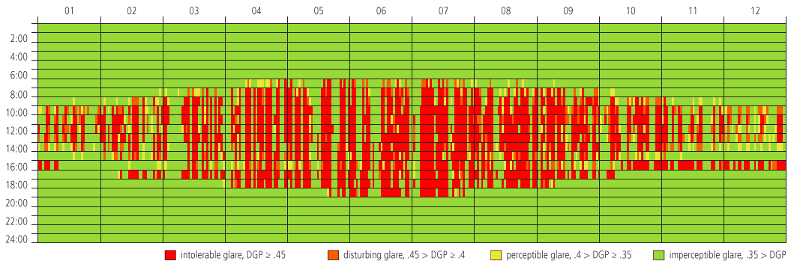
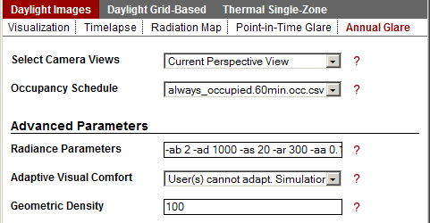

Annual Glare
================================================
An annual glare calculation uses a similar methodology to a Point-in-Time Glare image; however, the process is repeated for each hour in the year by using an annual DAYSIM prediction to calculate vertical eye illuminance and images with the ambient calculation turned off to predict contrast from direct sunlight. This produces an annual evaluation of comfort within a space, pictured below.

*Output from an annual glare calculation with no dynamic shading devices*

A Warning Regarding Simulation Time
---------------------------------------
Each annual glare simulation will respond to the dynamic shading controls specified in the Rhino file. If a complex dynamic shading system is defined, annual glare will be calculated for each state of the system. This can take a long time depending on the number of shading states and the complexity of the geometry. if you wish to absolve your computer of this computational responsibility, disable dynamic shading controls before running a simulation. This will illustrate visual comfort without shading. 

   
*Metrics Menu: Annual Glare*

Select Camera Views
	*Current Perspective View* will predict a simulation result for the current view in Rhino. If this is a saved view, the saved state of the view will be used.
	
	*Saved Rhinoceros Views* will run a simulation for every saved viewport in the Rhino file. It will not calculate a simulation for the Perspective view.

Adaptive Visual Comfort
	Selecting *User(s) cannot adapt* results in the lowest value for all camera views in the file being selected when displaying the annual falsecolor result graphic. This mode is useful when one user's ability to move around a space in response to visual comfort is being evaluated. 
	
	Selecting *User(s) can adapt* shows the predicted annual visual comfort for each simulated view. This is useful when evaluating the perception of multiple users in a space.
