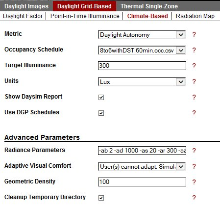

Climate-Based Metrics
================================================
Daylight Autonomy, Continuous Daylight Autonomy, Daylight Availability, Useful Daylight Illuminance
---------------------------------------------------------------------------------------------------------------

Metrics \>>\ Daylight Grid Based \>>\ Climate-Based
	Climate-Based Metrics use recorded climate data in the form of \*\.epw files to simulate the sun and sky conditions for various simulations including Daylight Autonomy, Daylight Availability, Continuous Daylight Autonomy and Useful Daylight Illuminance. The second important aspect of Climate-Based Metrics is that they are **annual** calculations which means they take the entire year into account. The metrics use Radiance and Daysim as their calculation engines.

*Metrics Menu: Climate-Based*

Units
----------------
(Lux, Footcandles)

Although Radiance and Daysim only use lux as a unit of illuminance, if you are working in and environment which reference footcandles, you select "Footcandles" as a unit here. The values will be converted over to lux in the simulation process and then back to footcandles for the display output.

Occupancy Schedule
----------------------
In this dialogue annual hourly occupancy schedules can be selected. These occupancy schedules are used to determine when a lighting or shading group is occupied. These files are stored in csv (comma seperated value) format under **c:\\\DIVA\\\Schedules.**

Target Illuminance
---------------------
Select a target illuminance level for your space. This level should depend on space type for example 500 lux of an office. For predominantly daylit spaces it has become customary to assume a target illuminance of 300 lux.
 
Show Daysim Report
---------------------
If selected a detailed Daysim report will be displayed in your browser.

Use DGP schedules
---------------------------
This option controls how a manually controlled dynamic shading system is being modeled. If the the user has run an annual glare analysis beforehand and this option is checked, the Lightswitch model will close the blinds as soon as the DGP in the `annual glare schedule`_ is above 40% (disturbing glare or worse). If left unchecked of if no annual glare analysis has been conducted, the blinds will be closed once direct sunlight above 50w/m2 is incident on the specified work place.

.. _annual glare schedule: http://daysim.ning.com/page/daysim-file-type-annual-dgp-profile

Adaptive Comfort
---------------------
This parameter determines how annual glare simulations inform the use of a dynamic shading system. If the shading system is manual controlled and more than one view point was provided for the annual glare calculation, then the former selection assumes that a user can *adapt* to the space and pick the position with the least amount of glare. In the latter case several occupants are in the space and the occupant with the worst glare condition determines whether the shading device needs to be readjusted.

Loading Metrics
--------------------

For detailed documentation of the climate-based metrics and methods, see:
C F Reinhart and J Wienold, "The Daylighting Dashboard - A Simulation-Based Design Analysis for Daylit Spaces", Proceedings of SimBuild 2010, New York City, August 2010.

Reinhart C F, Mardaljevic J, Rogers Z, ”Dynamic Daylight Performance Metrics for Sustainable Building Design”, Leukos 3:1, 2006

Bourgeois D, Reinhart C F, Ward G, "An inter-model comparison of DDS and Daysim Daylight coefficient methods", Proceedings of the European Conference on Energy Performance & Indoor Climate in Buildings (EPIC), Lyon, France, November 2006.
