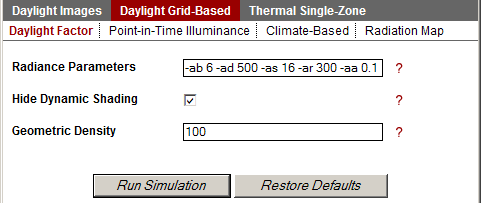

Daylight Factor and Illuminance
================================================
Daylight Factor
---------------------

Metrics >> Daylight Grid Based >> Daylight Factor
	A daylight factor is the ratio between exterior sky illuminance on an overcast day and illuminance inside a building. To run the metric, you must have first set up a sensor node grid using the **Nodes** button.
	

*Metrics Menu: Daylight Factor*

	Since the sky condition is overcast, neither a sky condition nor a date and time for the calculation are needed. You have the option to manually change your Radiance parameters and the geometric density of your geometry.

Illuminance
-------------------

Metrics >> Daylight Grid Based >> Point-in-Time Illuminance
	Illuminance calculations are also called "point-in-time" calculations because unlike the annual, or climate-based metrics, illuminance calculations measure light levels at a specific date and time. Like Daylight Factor, you will need to set up the sensor node grid, using the **Nodes** button before you run this metric.

Units
--------
Select your preferred lighting units, (Lux, Footcandles.)

Solar Date and Time
---------------------
Enter a date and time for the calculation. To enter minutes use an integer followed by a decimal point. For example, if you want to run a test on September 21 at 9:15am. Enter "09 21 9.25".
