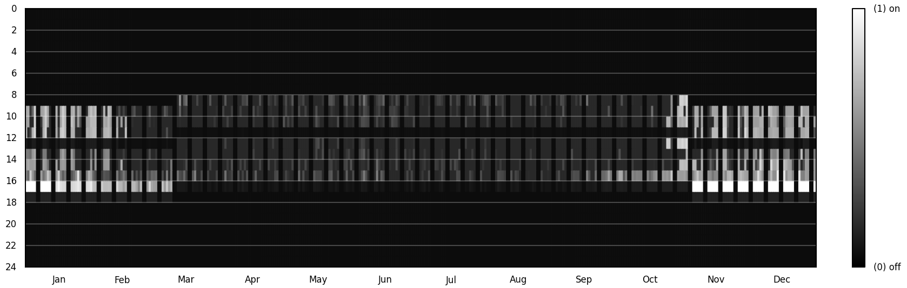
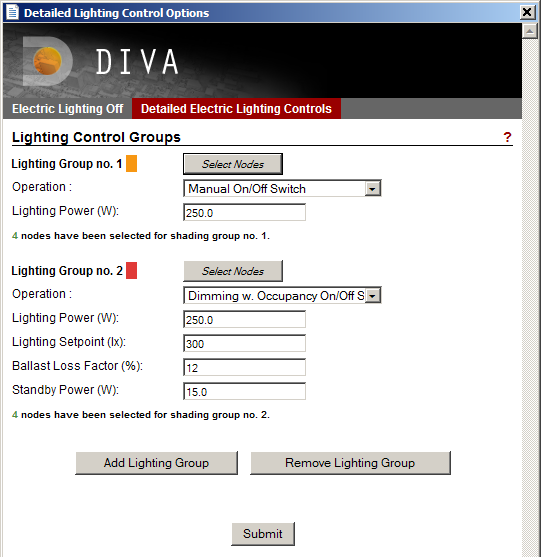

Lighting Controls
================================================
**Materials >> Lighting Controls**

*Example lighting schedule output from a DIVA climate-based simulation*

Lighting controls can be implemented in any Climate-Based Simulation, with or without dynamic shading devices. After running a climate-based analysis, hourly lighting schedules will be generated, and a falsecolor visualization of the schedules will be provided. 

*Lighting Control Interface*

Manual Controls 
------------------
Manual controls (Lighting Group no. 1 above) mimic the behavior of a user based on the statistical analysis of the 2002 Lightswitch study. Users occupying a space (defined by selected sensor nodes) are likely to turn off the lights at levels of around 250lx. 

Automated Controls 
-----------------------------------
Automated controls (Lighting Group no. 2 above) mimic a continuous dimming sensor with a user-defined setpoint, ballast loss factor and sensor standby power. The location of sensors are defined by the selected sensor nodes. 

Occupancy Sensors
-----------------------------------
Switch Off
	Controls with the "Switch Off" option makes sure that occupants do not leave the lights on at night; however, as DIVA/DAYSIM considers conscientious occupants, the statistical likelihood is low.

Switch On/Off
	Switch On/Off maintains lights always on while occupants are in the space. This mode is especially useful when modeling a scheduled continuous dimming system without a physical light switch.

Standby Power
-----------------------------
Standby power refers ot samll amoung of energy drawin by some automatically lighting systems even when the system is "off".

Ballast Loss Factor 
---------------------------------
Percentage of peak energy used by a dimming system when fully dimmed down.

 

