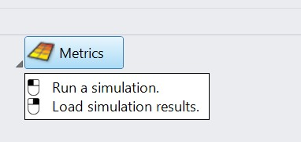
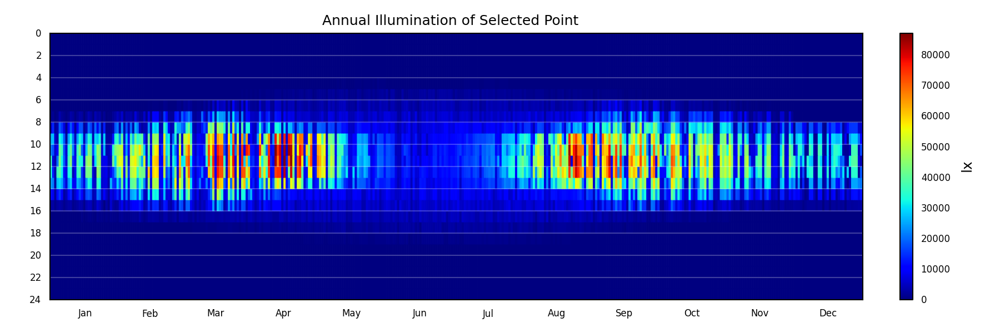
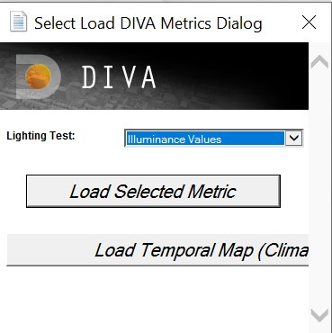

Load Metrics
================================================
To load previous results into your model, you right-click on the **Metrics** button. The **Choose** and **Load Metrics** boxes are displayed. The Load Metrics box is also displayed when any of the node-based metrics are finished running. The boxes provide options for how the results are displayed, and depend on which metric you are loading.

*Right-click on metrics to load existing simulation results*

**Lighting Test** prompts you to choose which metric to load. Most of these are self-explanatory; however, 'Illuminance from DA' is a new feature which allows visualization of the hourly illuminance results from Daysim / Climate-based metrics.

Choose **Select Metric to Load** if loading a grid-based result.

Choosing **Climate-Based Falsecolor** will allow an hourly temporal map of climate-based simulation results for a selected point.

*A result of the climate-based falsecolor option*

*Load metrics dialog*

Min/Max Illuminance 
-----------------------
(Illuminance and Continuous Daylight Autonomy)
	The user can set the lower and upper bounds which correspond to the colors displayed on the false-color node grid.

Min/Max Irradiance 
----------------------------------------
(Radiation Nodes)
	The user can set the lower and upper bounds which correspond to the colors displayed on the false-color node grid.

Min/Max Daylight Factor 
------------------------------
(Daylight Factor)
	The user can set the lower and upper bounds which correspond to the colors displayed on the false-color node grid.

Color Scheme
------------------- 
(All Metrics)
	This option lets the user select which color scheme to use for the false-color node grid.

Label 1% Peak Nodes 
--------------------------
(All Metrics)
	By checking this box, the 1% peak nodes will be highlighted.

Label All Nodes
------------------- 
(All Metrics)
	Checking this box will display the numeric result value at each node. These node labels are stored on their own DIVA sublayer called, "Node Values".

Color Extreme Values 
-------------------------
(Daylight Factor, Illuminance, Radiation Nodes, Continuous Daylight Autonomy)
	Panels whose values fall below the set range are shaded black and those that fall above are shaded bright pink.

Display Footcandles 
-------------------------
(Illuminance, Continuous Daylight Autonomy, Useful Daylight Illuminance, Daylight Autonomy, Daylight Availability)
	This should be checked if the user selected "footcandles" as the "Lighting Units" in the Metrics dialog box before running the metric.

Create Variant Label
---------------------------
(All Metrics)
	In this space the user can enter a "variant" label (or title) for the calculation. This helps in remembering key options that were being tested during the metric.

