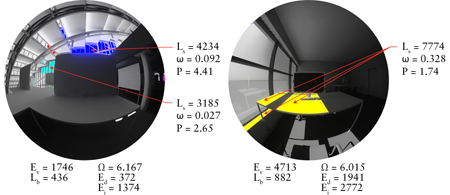
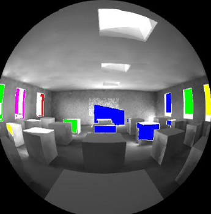

Point-in-Time Glare
================================================
**Metrics >> Daylight Images >> Point-in-Time Glare**

Using  a point-in-time glare simulation in DIVA, the visual comfort of a person under the simulated conditions at the camera viewpoint can be simulated. The Daylight Glare Probability (DGP) metric is used in the comfort evaluation which considers the overall brightness of the view, position of 'glare' sources and visual contrast. 

*Examples of visual comfort analysis in DIVA.*
*Areas of high contrast (3 times the mean image luminance) are highlighted in color.*

*Metrics Menu: Point-in-Time Glare*

The **camera type** is automatically changed to a 180 degree fisheye lens for the visual comfort analysis. Multiple camera views can also be selected from the "Select Camera Views" option.

The simulation uses evalglare v1.0 to calculate Daylight Glare Probability (DGP) from a luminance image based on total vertical eye illumance and contrast. One freely available paper on the method is found here.

The resultant image shows contrast-based glare sources highlighted in color, and displays text at the top of the image showing the numeric DGP rating as well as a plain-text description of the predicted glare for the specific luminance image.

