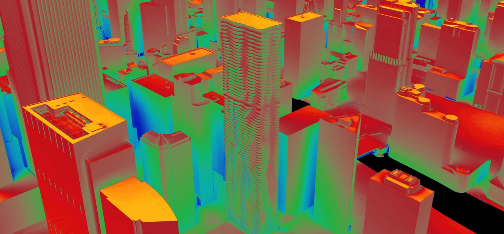

Radiation Maps
================================================

*Example of a radiation map generated in DIVA using rpict and gencumulativesky*

DIVA-for-Rhino can generate climate-specific annual surface irradiation images or calculate annual irradiation at node locations. This is a powerful tool that can be used on an urban or building scale to identify locations with solar energy conversion potential or areas in need of shading due to excessive solar exposure. Comparing summer and winter period irradiation results could help optimize shading devices to maximize winter gain while minimizing summer exposure.

The analysis uses a method described by `Robinson and Stone`_ which harnesses a Radiance module called GenCumulativeSky to create a continuous cumultaive sky radiance distribution. This cumulative sky is then used in a Radiance backwards ray-trace simulation. Compared to other approaches which use hourly calculations, this approach is significantly faster with a minimal sacrifice in accuracy.

.. _Robinson and Stone: http://www.solemma.net/references/PLEA2004_RobinsonAndStone.pdf