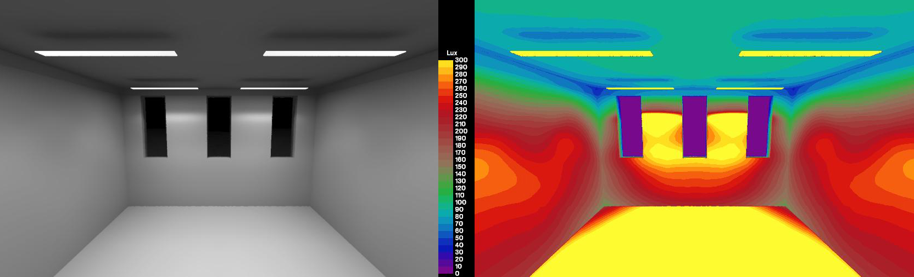
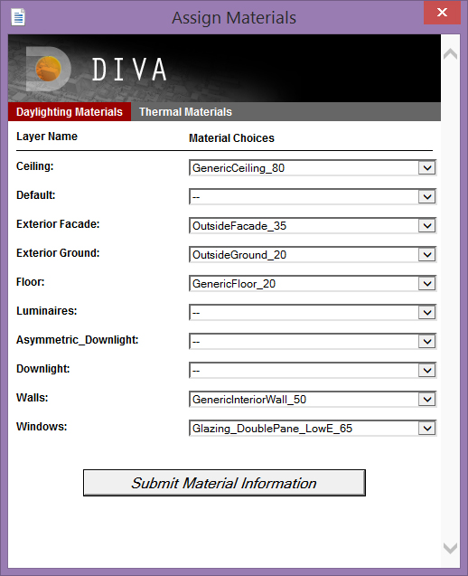
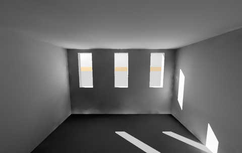
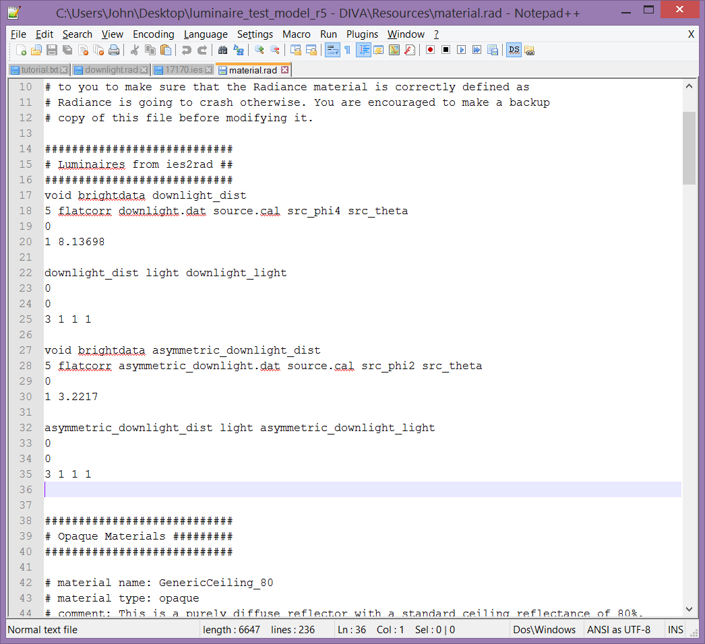
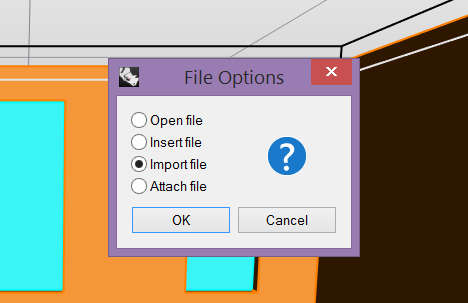
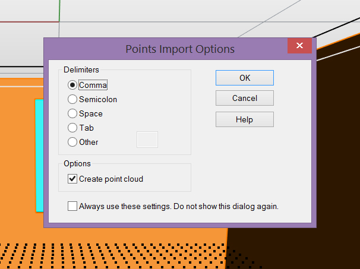
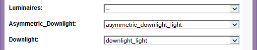
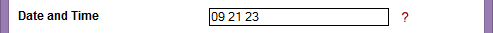
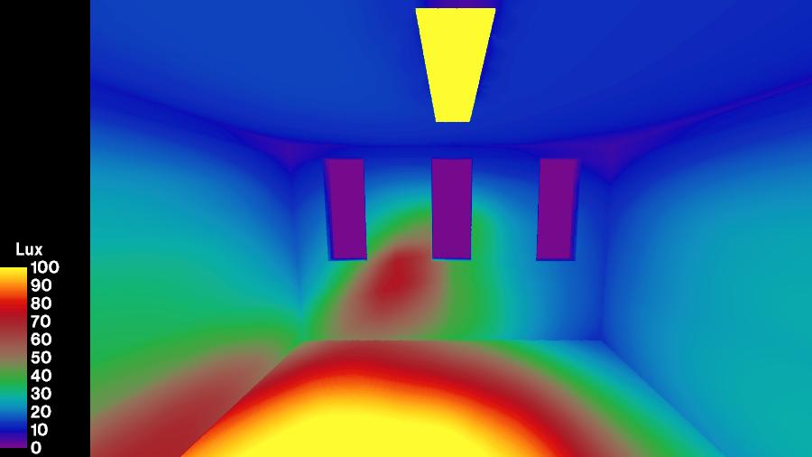

Simulating Luminaires with IES Files
================================================
Note: 
	A video tutorial on how to set up an electric lighting scene in DIVA-3.0 or DIVA 4.0 can be found `here.`_ The tutorial below applied for DIVA-2.0 users.
	
.. _here.: https://www.youtube.com/watch?v=W42ZSmCftkw	

Radiance, the simulation engine behind many of DIVA's metrics, is not only constrained to daylight. It is possible to simulate the resulting light distributions from luminaires based on measured data. This is accomplished by associating IES files, a standard file format for the electronic transfer
of photometric data, with geometry in DIVA. This page serves as a tutorial for getting such data into DIVA.

*Illuminance rendering, calibrated for human perception (left) and falsecolor (right)*

What You Will Need for This Tutorial
--------------------------------------------
Most luminaire manufacturers provide IES format files for their products. In this tutorial we are using two ies files from Phillips. You can go to most lighting manufacturer sites and download ies files of their products.

Furthermore, I built a small test room ideal for loading in IES files because its ceiling is slightly higher than Z=0, where IES files center the 'rough geometry' they contain. 

I recommend to download two IES files that you are interested in testing and use a Rhino scene of a simple space such as the `MIT Reference Office.`_ In Windows 8 you can create a command prompt easily in any folder, but if you’re using an older version, C:\\\luminaire_test\\\will work well.

.. _MIT Reference Office.: http://web.mit.edu/sustainabledesignlab/projects/ReferenceOffice/index.html

The IES Files 
-----------------------------
As mentioned in the introductory paragraph, IES files contain measured photometric data. You are probably familiar with the following kinds of figures to describe the photometric distribution of luminaires. The blue lines represent a vertical plane cut through the lighting distribution, and the red lines represent the horizontal distribution.

Step 0: Precautions 
---------------------------------
This tutorial requires the use of DIVA 2.1.1.0 or later, which was released on October 30, 2013. If you have an older version of DIVA, please download a more recent version from the Solemma website. When upgrading to a newer version of DIVA, we strongly recommend to delete the C:\DIVA\ folder before instaling. Backup your DIVA license files, custom materials and schedules first!

Step 1: Setup the Luminaire Test Rhino Model
----------------------------------------------
Go ahead and open the luminaire_test_model Rhino model. Click through the Location, Nodes and Materials buttons. I assigned standard materials to the layers. I set the grid spacing to 0.125 meters in order to have a finely meshed grid to visualize the lighting distribution. 

   
*Assign the default DIVA materials to your layers like so.*

Next, let's make sure everything is setup correctly by running a simple visualization. This should look like the below rendering.

*Test daylit rendering of the luminaire test room*

If all of the geometry shows up properly in the rendering, it is safe to continue. It is noticeable that the Radiance ambient parameters aren't perfect for this scene as indicated by the blotchy corners, but we'll worry about that later.

Step 2: Converting IES Files into the Radiance Format with ies2rad
-----------------------------------------------------------------------------
Open a command prompt and browse to the location where you saved the IES files. We will execute a command that comes with Radiance specifically for the purpose of importing measured luminance data, `ies2rad.`_ Since our Rhino file is in meters and the IES file will by default be converted into meters, no extra command parameter is necessary; however, if you are working in other units make sure to read about the -d command flag in ies2rad.

.. _ies2rad.: https://web.archive.org/web/20180305031100/http://floyd.lbl.gov/radiance/man_html/ies2rad.1.html

To convert the Microslot IES file (20277.ies) into a Radiance format, we will execute the following command,

	``ies2rad -o downlight 20277.ies``

The -o option specifies the output filename and material name. "downlight" is a much better material name than 20277! We should do the same for the Designer Asymmetric KSH 3EA Lens Recessed file (17170.ies) with the -o option set to "asymmetric_downlight." You will note that an error about lamp type not being recognized is thrown when running the command on the asymmetric light. This isn't really important unless you are trying to compare the coloration of multiple disparate lamp types in a scene and is outside of the scope of this tutorial. 

Another important thing to note is that by default, this process does not consider dirt depreciation factors. If you wish to apply a 15% reduction in luminous distribution due to dirt accumulation, include "-m 0.85" in your ies2rad command.

From running these two commands, four files should be created: downlight.dat, downlight.rad, asymmetric_downlight.dat and asymmetric_downlight.rad. The DAT files are a converted datafile containing information about the luminous distribution of the light source. The RAD files contain Radiance format 'rough' geometric representations of the luminaires and material definitions.

Step 3: Getting the Radiance data into DIVA
------------------------------------------------
The two DAT files should be copied to the **C:\\\DIVA\\\Temp\\\luminaire_test_model_*\\\** folder. We will be putting them in the Temp folder so that they are only accessible to the current simulation model. If you want to keep a luminaire for all future DIVA models, save the files in **C:\\\DIVA\\\Radiance\\\lib\\\.**

Now that the luminous distribution files are accessible by the simulation program, let's open one of the RAD files in a plain text editor such as Notepad or `Notepad++.`_ I'll use the Microslat downlight as the example here (downlight.rad). You should see the following,

.. _Notepad++.: https://notepad-plus-plus.org/

``# ies2rad -o downlight``
	
``# Dimensions in meters``	

``#<IESNA:LM-63-1995``
	
``#<[TEST] 20277``
	
``#<[DATE] 01/03/2000``
	
``#<[LUMCAT] MSG128-W-1/1-EB``
	
``#<[LUMINAIRE] DAY-BRITE 4' MICROSLOT W/SOLID WHITE ARCHITECTURAL BLADES``
	
``#<[LAMP] F28T5``
	
``#<[BALLAST] ENERGY SAVINGS ES-1-T5-28-120-F``
	
``#<[MANUFAC] PHILIPS DAY-BRITE``
	
``#<[_TIFF_FILE_NAME]``
	
``#<[_VERSION] 2.0u``
	
``#<[OTHER] Reflection factor 0.95, Test distance = 26 ft.``
	
``#<[MORE] Shielding angle: normal 0, Parallel 30``
	
``# CIE(x,y) = (0.333300,0.333300)``
	
``# Depreciation = 100.0%``
	
``# 30 watt luminaire, lamp*ballast factor = 0.94``

A description of mostly plain text fields in the original IES file.

``void brightdata downlight_dist``
	
``5 flatcorr downlight.dat source.cal src_phi4 src_theta``
	
``0``
	
``1 8.13698``

``downlight_dist light downlight_light``

``0``

``0``

``3 1 1 1``

Radiance material definitions that reference downlight.dat.

``downlight_light polygon downlight.d``

``0``

``0``

``12``

``-0.606415 -0.047625 -0.00025``

``-0.606415 0.047625 -0.00025``

``0.606415 0.047625 -0.00025``

``0.606415 -0.047625 -0.00025``

A Radiance-format four point polygon centered about X=0,Y=0 and slightly below Z=0.

The section described as, "Radiance material definitions that reference downlight.dat" can be copied directly into .\luminaire_test_model_* - DIVA\Resources\material.rad to be used with the current simulation project. The modified section of my file looks like below.

*Amended material.rad file in the - DIVA\\\Resources\\\folder*

Step 4: Getting the Geometry into DIVA
-------------------------------------------
The IES data is very dependent on the geometry size and direction (surface normal) to be correct. As noted in step 3, this is a four point polygon. IES files can also contain boxes or cylinders. It is important to note that one cannot, at this time, model a Radiance cylinder primitive in DIVA. Boxes and simple polygons work just fine though. Anyways, we want to create the exact geometry that comes from the ies2rad conversion within DIVA.

One way to ensure accuracy is to load the four vertices of the polygon into Rhino 5 as points. We could do this manually, but for a box with 6 x 4 = 24 points, it would be very tedious. I like to copy the point portion of the geometry into a new plain text file,

``-0.606415 -0.047625 -0.00025``
	
``-0.606415 0.047625 -0.00025``
	
``0.606415 0.047625 -0.00025``
	
``0.606415 -0.047625 -0.00025``

And replace the tabs separating the numbers with commas using find and replace,

``-0.606415,-0.047625,-0.00025``
	
``-0.606415,0.047625,-0.00025``
	
``0.606415,0.047625,-0.00025``
	
``0.606415,-0.047625,-0.00025``

Finally, we can save this file as downlight.csv. Make the "downlight" layer already created in the file your active layer. Later we will assign the downlight illuminating material to this layer. To load the points into Rhino 5, just drag-and-drop the CSV file into the Rhino window, select "Import file," press "OK" and then press "OK" again, leaving the point import options as the defaults.

*Select "Import file" when prompted.*

*Leave the other options as the defaults and press "OK."*

Now we're almost done. Turn on the point Osnap in Rhino and draw a polygon between the four points using the Plane command. Use the Dir command to make sure that the surface normal is **pointing down.** This is very important, as otherwise the polygon will not illuminate the scene.

Step 5: Finally Rendering Luminaires with Associated IES Information
-----------------------------------------------------------------------
Run the Materials command again and apply the downlight_light material to the downlight layer that you created the polygon on.

*Apply the appropriate materials created in Step 3 to your Rhino layers.*

Finally at this point an image or grid-based simulation can be rendered! Make sure to set the time to a period when the sun isn't up, such as 23:00.

*Set the time to a dark period such as 23, 11:00 PM*

And then run the metric by clicking "Run Simulation."

Visualizations can also be rendered. I recommend to clear out the "Radiance parameters" box and replace it with the following,

	*-ab 3 -aa .1 -ar 500 -ad 1024 -as 512 -i*

This allows many of the default Radiance ambient parameters that deal with sampling illuminating surfaces to be set without us having to worry about it. A brief explanation of what is left is explained below,

**ab,** ambient bounces: the light will bounce three times

**aa,** ambient accuracy and **ar,** ambient resolution: these control the level of interpolation between rays

**ad,** ambient divisions: 1024 rays are shot from each reflection

**as,** ambient supersamples: if there is a large luminous difference between nearby rays, the number of extra rays to be shot to resolve the transition accurately.

**i,** illuminance boolean trigger: render an illuminance rather than a luminance image

*Falsecolor illuminance distribution of asymmetric downlight*

Concluding Remarks
---------------------
It is necessary to mention that the luminaire geometry can be moved and copied freely about the Rhino file. However, it **cannot be rotated or scaled** in any way at this time while maintaining the proper luminous distribution from the IES file.

This process will, one day, be fully automated within DIVA.

 

