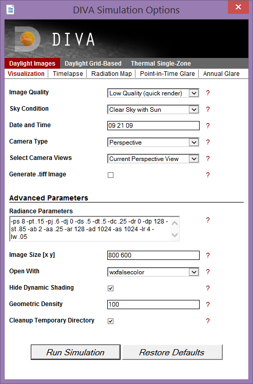

Simulations in General
================================================
In the Metrics dialog box, there are many options which are common to two or more simulation types. Since these are common to several simulation types, we will review them all in one place (this page).

These options include:

- Quality Preset and Radiance Parameters
- Sky Condition
- Date and Time
- Hide Dynamic Shading
- Geometric Density

And for Image-based simulations:

- Camera Type
- Camera Views
- Generate .tiff
- Open With
- Image Size

*DIVA Simulation Menu*

Image Quality and Radiance Parameters
----------------------------------------
Each quality preset relates to a set of Radiance parameters which can be seen and edited in the "Advanced Parameters" section of the dialog box. These settings set things like the number bounces and the number of rays that the Radiance engine will calculate for the simulation. It is not advisable to manually change these settings unless you have first understood the various Radiance commands and their respective values. For more information, see: `Radiance Manual`_

.. _Radiance Manual: https://floyd.lbl.gov/radiance/refer/ray.html

Make sure that you follow the conventions for specifying variables (e.g. "-ab", not "ab").

For quick tests, the Low preset is fine, but for good, reliable results the High Preset is recommended. The Medium setting can be a good option for simulations that could possibly run extremely long if set to "High". Since many Radiance simulations involve a stochastic process, re-running the exact same simulation can produce slightly different results each time. Higher resolution settings will reduce the variability in results, but at the expense of longer simulation times.

Sky Condition
-----------------------------
You can specify a number of different sky conditions for your scene as explained below. The most common options typically used are Sunny or Cloudy.

- **Sunny Sky:** Uses the Radiance program gensky to model a CIE clear sky. This is a standard file defined by the International Commission on Lighting (CIE).
- **Cloudy Sky:** Uses the Radiance program gensky to model a CIE overcast sky. This is a standard file defined by the International Commission on Lighting (CIE). It is bright near the zenith and rotationally invariant, meaning that it looks the same in all orientations. This is the reference sky for the daylight factor.
- **Custom Sky:** In case you are interested in modeling a particular sky,for example when you have taking illuminance measurements of a space and you would like to model the space now under the same daylighting conditions. you can use the Perez sky model (Radiance program gendaylit) which requires as input date and time as well as measured direct and diffuse horizontal irradiances.
- **Clear sky without Sun:** Same as clear sky but without  the solar disk. Some designers like using this theoretical (non physical) sky to distinguish between lighting contributions from  the celestial hemisphere and from direct sunlight.
- **Uniform:** Uses the Radiance program gensky to model a completely uniform sky.The underlying uniform sky model was used before the CIE overcast and other sky models were introduced- .

Date and Time
---------------------------------
The solar date and time are set by specifying month, day and hour in the format: mm dd hr (a single space between each entry). For instance: December 10 at 3:15pm would be: 12 10 15.25.
Solar Date and Time mean that the sun position is calculate taking the Equation of Time into account, and WITHOUT daylight savings time.

Hide Dynamic Shading
----------------------------------------------
If selected any Rhino layer that is modeled as a dynamic shading systems such as a lowered venetian blind is excluded from all calculations except for climate-based metrics and electric lighting simulations.

Geometric Density
------------------------------------------------
To use a finer mesh resolution when running any of the Metrics, adjust the “Geometric Density” option. Values range between 0 and 100. “0” represents the crudest resolution of curves and complicated surfaces, where as “100” produces the most refined resolution.

Camera Type
-------------------------------------------
DIVA Image simulations will only successfully run when the projection of the view you want to run is set to "Perspective Projection" in Rhino. If your view is set to an Orthographic Projection, an error will appear. To change the projection of your view in Rhino. Make sure that nothing is selected, and navigate to the "Properties" menu. Under "Viewport", there is an option which says "Projection". You can change the setting there.

The 180 degree fisheye automatically set when the Run Evalglare check box is checked.

Camera Views
---------------
By default, when running an Image simulation, DIVA will render the current view in Rhino. The "Saved Views Only" option allows you to run only the views you have saved under "Named Views" in Rhino. With either choice, remember to make sure they have a Perspective projection.

Generate.tiff
----------------
Image simulations automatically create a \*\.pic file which is effectively, an \*\.hdr (high-dynamic range) image. Unfortunately, these images cannot be opened by most photo previewers and NOT by Photoshop. In the wxfalsecolor window, you have the option to save the file that is generated as several file types, including a jpeg, but checking the "Generate .tiff" dialog box will save you the extra step of saving the image and will automatically generate and store the image as both a \*\.pic and \*\.tif in your results folder.

Open With
-----------
wxfalsecolor is a program developed by Thomas Bleicher and is automatically installed with DIVA. In order to use the Radiance IV option, you must have the Radiance Image Viewer installed on your computer.

Image Size
-------------
The dimensions of your output image can be set here. Values are entered in pixels x pixels in the format: integer integer. For instance 640 x 480 would be entered as: 640 480.

Cleanup Temporary Directory
----------------------------
Selecting this option will automatically clean up unnecessary files from the C:\\\DIVA\\\Temp\\\[RhinoFilename] directory.

 

