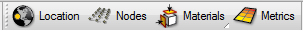
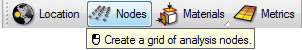
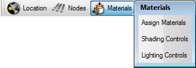
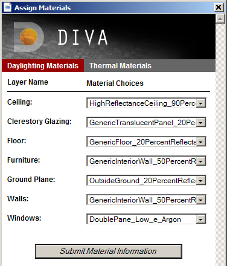

The DIVA User Interface Part 1
==============================

The Toolbar
----------------------------------
After following the instructions in Installation, the DIVA toolbar will be visible within Rhinoceros. The toolbar contains four buttons: Location, Nodes, Materials, and Metrics. 

   
*The four buttons of the DIVA 2.0 toolbar*

These buttons are primarily designed to be used in order from left to right to run daylight and energy simulations. Several of the DIVA toolbar buttons have two functions: one is accessed by a mouse left click and the other via a mouse right click. In essence, there is no “Undo” for the buttons. If you have made a mistake, or you wish to change any option, simply press the appropriate button and change the settings. 

Location 
----------------------------------------------------
The “Project Info” button has two functions. The first is similar to “New File” or “Save As” in other programs. It sets up a folder and a naming convention for results files. The second function is to establish the latitude, longitude and timezone of a project by associating it with a climate (.epw) file. For climate-based simulations and radiation maps, the hourly solar insolation is also read from the EPW file.

The Boston climate file is loaded with the DIVA plug-in into the folder C:\\\DIVA\\\WeatherData. There are a plentiful amount of free EPW files available for download from the US Department of Energy's Website. Save these files to the same C:\\\DIVA\\\WeatherData directory. 

Nodes
------
The sensor nodes are the points at which the light levels are calculated. 

*Nodes Button*

Left-clicking on the button sets up an analysis grid for any nodes-based simulations in DIVA. The nodes array size, location and orientation are based on a piece of geometry from your model that you select. This can be a floor, wall, or any other surface, or multiple surfaces, and can be in any orientation (horizontal vertical, at an angle, etc.).

Surface Normals
---------------
The normal direction of the surface determines the orientation of the sensors. This is visualized by the direction the nodes are offset from the surface. If the point objects appear below the analysis surface, the normal of the surface should be flipped and the above process followed again. The 'Dir' command in Rhino can be used to visualize and flip surface normals.

Node Offset and Spacing
-----------------------
Typically, the sensor nodes are offset a specified distance off of the selected surface, and a specified distance apart. DIVA will prompt you to select these values, and suggests default values. Those values are always shown in the current model units. This can be feet, inches, meters, etc.

**Tip: For typical workplane simulations, the sensor grid is set 30" off the floor and the nodes are no more than 36 " apart.**

Nodes and the Test Surfaces Layer
----------------------------------
The "Test Surfaces" DIVA sublayer is a helpful place to store a reference surface if that surface does not exist as part of your built geometry. For instance, if you want to test only part of the floor or wall, you can make a surface on the "Test Surfaces" layer which is the size of the area you want to focus on.

Materials
-----------
Materials must be assigned to the project geometry in order for it to be analyzed for daylight or energy performance. 

*Materials button sub-menu*

Once your project location and sensor grid is established, Radiance materials must be applied to layers in the Rhino model. Each layer that the user wants to include in the simulation needs to have a material associated with it. To assign materials, use the Materials button and the "Assign Materials" option. A small library of useful materials is included with DIVA, and will show up as options in the pull-down menus.

*Materials Menu*
   
Custom Materials
----------------
Note that customized Radiance materials can be added to the material choices. See the page, Custom Radiance Materials for more information. By default, DIVA instantiates each project with the default materials file, located in **C:\\\DIVA\\\Daylight\\\material.rad.** Project-specific materials can be defined in the **.\\\ProjectName - DIVA\\\Resources\\\material.rad file.** The ProjectName - DIVA directory is located in the same folder as your Rhino file.

 

The materials menu has two tabs: Daylight Materials and Thermal Materials. Use the one appropriate for the simulations you will be running, or both you are running both.

