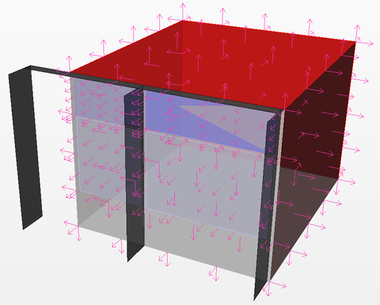

Thermal Analysis
================================================
DIVA-2.0 allows the modeling of single-zone thermal models using EnergyPlus. These models are automatically linked, through the software interface, with detailed lighting and shading schedules generated by DIVA/DAYSIM. In effect, this allows one to test the relative effect of different daylighting and controls strategies on the energy consumption of a typical daylit space.

*DIVA hourly heating and cooling energy consumption output*

Geometry Creation
------------------------
To translate a daylighting model into a thermal model, several simplifications must be made. While daylighting models can easily account for complex, volumetric geometry, thermal models must be built as planes. A layer structure under the parent layer name DIVA Thermal is automatically created for this purpose when the Location button is pressed. The geometry on the DIVA Thermal layers will never be exported to DIVA-Daylighting simulations. The diagrams below are useful to show the differences between daylight and thermal models, and both are representations of the same space.

Note that in the planar thermal model that the blind system is not modeled explicitly as it is a dynamic shading device; however, the outside structural members have been modeled on the ep_shading layer as they are always present. Also in the thermal model it is very important not to punch holes for the window openings, and each window should only intersect with one wall or ceiling surface. A window should never touch the edge of a parent surface. 

*Thermal geometry must also have all surface normals pointing outwards from the space.*

*In this image, the Rhino "Dir" command is used to check and adjust surface orientation.*

Running Thermal Simulations
------------------------------
Generating Shading, Lighting and Occupancy Schedules from Climate-Based Simulations
	Climate-based simulations including all desired shading and lighting schedules should be run before a thermal analysis. The generated schedules will be offered as input options into the thermal simulation.

Layer Structure and Applying Thermal Materials  
	The layers automatically created under DIVA Thermal can all contain thermal simulation geometry. Also, any sublayer under the automatic layers can contain thermal simulation geometry. ep_adiabatic contains surfaces with mass, but no heat transfer occurs through them. ep_ceiling contains roof or ceiling surfaces. ep_floor contains floor surfaces. ep_shading contains fixed exterior shades such as buildings or louvers. ep_wall contains exposed wall surfaces. ep_window contains windows associated with surfaces on ep_wall or ep_ceiling (see the geometry creation section above for details). In addition, in the example below the sublayer clerestory_windows also serves as a window layer with a different material definition and shading schedule.

*Geometry can be modeled on the base DIVA-Thermal layers or on any sublayer, which allows multiple material types and dynamic shading locations in one simulation. In this example, there is a separate layer for the clerestory windows*

*The thermal tab under Materials > Assign Materials is used to set thermal material properties.*

Running a Simulation / Simulation Parameters
	From the Metrics button, clicking the Thermal Single-Zone tab brings up the thermal simulations options menu. 

*Metrics Menu: Thermal Single-Zone*

Occupant Density
	The area each occupant inhabits in square meters. For example, a value of 10m²/occupant in a space with a floor area of 100m² equates to 10 occupants in the space. 

 

Equipment Power Density
	Watts of eternal equipment load per square meter of floor area. In the same 100m² space, a value of 4W/m² equates to an equipment load of 400W. 

 

Air Changes Per Hour
	The frequency with which fresh air enters from the outside due to air leaks in construction assemblies. If our 100m² has a ceiling height of 4m and the air change rate is 0.5ACH, then 200m³ of fresh ourdoor air enters per hour. 

 

Heating Efficiency
	An efficiency factor which is applied to the calculated space heating loads. Load/Efficiency gives the predicted energy use.

 

Cooling Efficiency
	An efficiency factor which is applied to the calculated space cooling loads. Load/Efficiency gives the predicted energy use.

 

Setpoints
	The setpoint and setback temperatures (in degrees Celsius) for cooling and heating form a deadband zone during the entire year. Heating and cooling is, by default, available the entire year. The setpoint temperatures are used during typical occupied hours and the setback temperatures are used during unoccupied hours.

 

Natural Ventilation
	Forthcoming.

 

J A Jakubiec and C F Reinhart, "DIVA-FOR-RHINO 2.0: Environmental parametric modeling in Rhinoceros/Grasshopper using Radiance, Daysim and ""EnergyPlus", Building Simulation 2011, Sydney, Australia.
