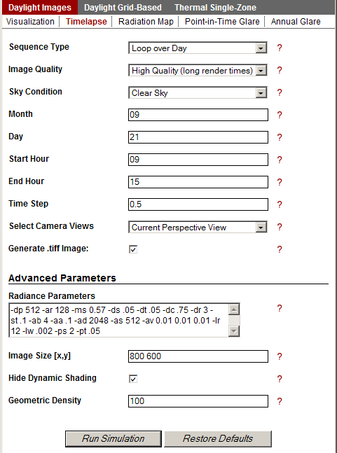

Timelapse Images
================================================
Metrics  >> Daylight Images >> Timelapse
	This simulation was created to allow the user, with a single command, to run visualizations through a year, day or only on the Solstices and Fall Equinox. 

Loop Over Months
	The year sequence runs the visualization for the same day of the month and time of day for each month of the year. So, for instance, if the user selected 15 for the day and 12 for the hour, the simulation would produce 12 images: January 15, at 12:00pm, February 15, at 12:00pm, March 15, at 12:00pm, etc.
	
Loop Over Day
	The day visualization sequence has the most variables. The user selects a month and day. They determine when to start the sequence (start hour) and when to end it (end hour) and how big an interval between images (timestep). For instance, for to produce one image for each hour from 9:00am to 3:00pm on June 01:

- Month: 06

- Day: 01

- Start Hour: 09

- End Hour: 15

- Time Step: 1

*Entering minutes for time steps*

To enter minutes for time step, enter the number as a decimal. For instance, to step every 15 minutes, enter 0.25 in the time step field; for one and a half hours, enter 1.5. 

Loop Over Solstice and Equinox Days
	This sequence analyzes a user-determined hour on 3 dates: 6/21, 9/21, 12/21 (approximating the Summer and Winter Solstices and the Fall Equinox). For instance, if the user selects 10 for the hour, then three images will be produced at 10am on each of the three above dates.
*Please note that only the Fall Equinox is used in this simulation (not the Spring Equinox).*
 
 