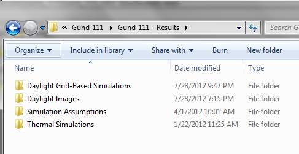
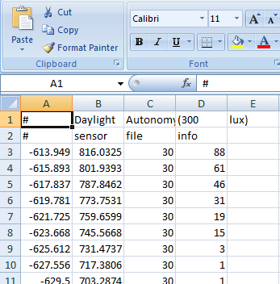

Understanding Results Files
================================================
DIVA Grid-Based Results
---------------------------
When you run a DIVA simulation, a directory of files is created for you, and depending on the metric you run, different file types will be created. For Daylight Grid-Based Simulations these files are basic text files with different file extensions.  In this tutorial, we are going to take a look at the results files for Daylight Factor, Point-in-Time Illuminance, Climate-Based Metrics and Radiation Maps and learn what information they contain and how to use them to learn more about your analysis.

The two basic file types (file extensions) for the Daylight Grid-Based simulations are \*\.dat and \*\.da: 

.dat files
	- Daylight Factor                                   \*\.df.dat
	
	- Radiation Maps                                 \*\_ radmap.\*\.dat
	
	- Point-in-Time Illumiannce               \*\.dat
	
.da files
	- Daylight Autonomy                            \*\_autonomy.shading.da

	- Daylight Availability                           \*\_availability.shading.da
	
	- Continuous Daylight Autonomy      \*\.shading.cda
	
	- Useful Daylight Illuminance            \*\_UDI_100.shading.da, \*\_UDI_100_2000.da, \*\_UDI_2000.da

Viewing Grid-Based Results
-----------------------------
These files can be easily viewed in any basic text editor, such as Text Pad, or they can be imported into spreadsheet programs, like Excel, for analysis. First, let’s look at how we would import a .dat file into Excel.

   
*DIVA Results Directory*
   

- Step 1           Run a Point-in-Time Illuminance metric and locate the results file
- Step 2           Click FileàOpen
- Step 3           Change “File Type” to “All Files”
- Step 4           Browse to your results folder
- Step 5           Select the .da or .dat file that you want to open
- Step 6           Use the screen shots below to guide the rest of the import

Understanding Grid-Based Results 
--------------------------------------
When you open any of these files, some parts are the same regardless of which file you look at.  All .DA files will have some basic information at the top which identify the name of the metric, and some basic information such as the design illuminance threshold. The other information common to all files is a series of lines at the end of the file, all preceded by “#”. There is one set of these lines for each set of nodes in your model (a nodegroup is the group of nodes associated with one surface in your model). For the most part, you don’t need this information. It is primarily used by DIVA for loading in files.

*.da file in Excel*

The important part of the files is the middle section. Regardless of the results file, each line contains information for one of the sensor nodes in your model. The first three numbers of each line are the x, y and z coordinates of a given sensor node. For the all of the .dat files, there are a second set of three numbers which are the x, y, and z components of the node vector (this gives the node orientation).

 

The last numbers are the metric value for the associated node. For the .dat files there are three numbers which are the R, G and B components of the Daylight Factor, Irradiation, and Illuminance. In the file they are in this order: R-value, G-value, B-value. You may notice that none of the columns contain values that equal the node values displayed by the same file in the model. These three values represent a weighted contribution to the final Daylight Factor, Irradiation or Illuminance value. To derive that result, a factor is placed on each component and the weighted values are summed.

For the Daylight Factor and Radiation Maps metrics, this equation is: R*0.265 + G*0.67 + B*0.065, where R, G and B are the R, G, B values from the last three columns of the results file. For the Illuminance metrics, the equation remains the same, but the entire sum is multiplied by 179: (R*0.265 + G*0.67 + B*0.065)*179. For the .da files, there is just one number after the sensor node coordinates which is the DA value. No additional steps are necessary to derive a final answer.

Once you have your values in place, you can Excel’s functions and graphing capability to analyze your results in hundreds of ways.
