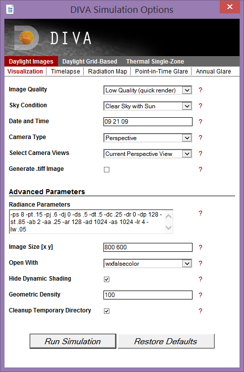

Visualization
================================================
Metrics  >> Daylight Images >> Visualization
	The Visualization simulation creates a Radiance rendering (\*\.pic) of the selected Rhino view of your model. This is a useful simulation to run **before all other simulations,** because it provides very useful information as to whether your model geometry is defined correctly and properly exporting. Sometimes surface normals are flipped, geometry is turned off or has not been defined a material, or other inconsistencies occur. The visual check allows you to preview the model the way Radiance sees it before running your simulation. Make sure your selected viewport is a perspective view and **not an orthographic projection** (Front, Top, etc...).

   
*Metrics Menu: Visualization*